# Mes optimisations

## Performance

### Ressources en ligne


:::tip version des ressources
| Problème identifié | Éliminer les ressources bloquant le rendu : bootstrap.css et jquery-2.1.0.js |
|-----------|-------------|
| Explication du problème | Les ressources bloquent la première peinture de votre page. Envisagez de fournir des JS/CSS critiques en ligne et de reporter tous les JS/styles non critiques. |
| Bonne pratique à adopter | Déplacez le code de l'URL de blocage de rendu vers une balise `<script>` en ligne dans votre page HTML.<br />Ou marquer l'URL avec des attributs `async` ou `defer` |
| Action recommandée | Charger bootstrap et jquery en ligne |
| Référence | <a href="https://web.dev/render-blocking-resources/?utm_source=lighthouse&utm_medium=devtools">Eliminate render-blocking resources</a> - web.dev |

```html {1,8,14} title="index.html"
<link rel="stylesheet" type="text/css" href="./css/bootstrap.css">
<!-- Remplacer par -->
<link rel="preload" as="style"
      href="https://stackpath.bootstrapcdn.com/bootstrap/3.4.1/css/bootstrap.min.css"
      integrity="sha384-HSMxcRTRxnN+Bdg0JdbxYKrThecOKuH5zCYotlSAcp1+c8xmyTe9GYg1l9a69psu"
      crossorigin="anonymous">

<script src="./js/jquery-2.1.0.js"></script>
<!-- Remplacer par -->
<script defer src="https://cdn.jsdelivr.net/npm/jquery@2.2.4/dist/jquery.min.js"
        integrity="sha256-BbhdlvQf/xTY9gja0Dq3HiwQF8LaCRTXxZKRutelT44="
        crossorigin="anonymous"></script>

<script src="./js/bootstrap.js"></script>
<!-- Remplacer par -->
<script defer src="https://stackpath.bootstrapcdn.com/bootstrap/3.4.1/js/bootstrap.min.js"
        integrity="sha384-aJ21OjlMXNL5UyIl/XNwTMqvzeRMZH2w8c5cRVpzpU8Y5bApTppSuUkhZXN0VxHd"
        crossorigin="anonymous"></script>
```

:::

### CSS inutilisé

:::tip Réduire les CSS inutilisés
| Problème identifié | Réduire les CSS inutilisés |
|-----------|-------------|
| Explication du problème | Réduire les règles inutilisées des feuilles de style et différez le CSS non utilisé pour le contenu au-dessus de la ligne de flottaison afin de réduire les octets consommés par l'activité du réseau. |
| Bonne pratique à adopter | Supprimez le CSS inutilisé pour réduire les octets inutiles consommés par l'activité réseau |
| Action recommandée | Supprimer bootstrap du dossier css, le charger en ligne et demander la feuille de style de manière asynchrone |
| Référence | <a href="https://web.dev/unused-css-rules/?utm_source=lighthouse&utm_medium=devtools">Remove unused CSS</a> - web.dev |

```html title="index.html"
<!-- changer -->
<link rel="stylesheet" type="text/css" href="./css/bootstrap.css">
<!-- par -->
<link
    rel="preload"
    as="style"
    href="https://stackpath.bootstrapcdn.com/bootstrap/3.4.1/css/bootstrap.min.css"
    integrity="sha384-HSMxcRTRxnN+Bdg0JdbxYKrThecOKuH5zCYotlSAcp1+c8xmyTe9GYg1l9a69psu"
    crossorigin="anonymous">
```
:::

### JavaScript inutilisé

:::tip Réduire le JavaScript inutilisé
| Problème identifié | Réduire le JavaScript inutilisé |
|-----------|-------------|
| Explication du problème | Réduire le code JavaScript inutilisé et reportez le chargement des scripts jusqu'à ce qu'ils soient nécessaires pour réduire les octets consommés par l'activité du réseau. |
| Bonne pratique à adopter | Supprimer JavaScript inutilisé |
| Action recommandée | Supprimer jquery du dossier js, le charger en ligne et différer son chargement |
| Référence | <a href="https://web.dev/unused-javascript/?utm_source=lighthouse&utm_medium=devtools">Remove unused JavaScript</a> - web.dev |

```html title="index.html"
<!-- changer -->
<script src="./js/jquery-2.1.0.js"></script>
<!-- par -->
<script
    defer
    src="https://cdn.jsdelivr.net/npm/jquery@3.6.0/dist/jquery.min.js"
    integrity="sha256-/xUj+3OJU5yExlq6GSYGSHk7tPXikynS7ogEvDej/m4="
    crossorigin="anonymous">
</script>
```
:::

### Minifier les fichiers css et js

:::tip Minifier les fichiers css et js
| Problème identifié | Minifier les fichiers CSS et JavaScript |
|-----------|-------------|
| Explication du problème | La réduction des fichiers CSS et JavaScript peut réduire la taille de la charge utile et le temps d'analyse des scripts. |
| Bonne pratique à adopter | Minifier les fichiers CSS et JS |
| Action recommandée | Minifier les fichiers des dossiers "css" et "js"|
| Référence | <a href="https://web.dev/unminified-css/?utm_source=lighthouse&utm_medium=devtools">Minify CSS</a> - web.dev<br /><a href="https://web.dev/unminified-javascript/?utm_source=lighthouse&utm_medium=devtools">Minify JavaScript</a>  - web.dev |

```text
style.css                       =>  style.min.css

css
    font-awesome.css            =>  font-awesome.min.css
    et-line.css                 =>  et-line.min.css

js
    blocs.js                    =>  blocs.min.js
    formHandler.js              =>  formHandler.min.js
    gmaps.js                    =>  gmaps.min.js
    jqBootstrapValidation.js    =>  jqBootstrapValidation.min.js
    jquery.touchSwipe.js        =>  jquery.touchSwipe.min.js
```

```html title="index.html"
<!-- Modifier -->
<link rel="preload" as="style" type="text/css" href="style.css">
<link rel="stylesheet" type="text/css" href="style.css">
<link rel="stylesheet" type="text/css" href="./css/font-awesome.css">
<link rel="stylesheet" type="text/css" href="./css/et-line.css">
<script defer src="./js/blocs.js"></script>
<script defer src="./js/jquery.touchSwipe.js" defer></script>
<script defer src="./js/gmaps.js"></script>
<!-- par -->
<link rel="preload" as="style" type="text/css" href="style.min.css">
<link rel="stylesheet" type="text/css" href="style.min.css">
<link rel="stylesheet" type="text/css" href="./css/font-awesome.min.css">
<link rel="stylesheet" type="text/css" href="./css/et-line.min.css">
<script defer src="./js/blocs.min.js"></script>
<script defer src="./js/jquery.touchSwipe.min.js" defer></script>
<script defer src="./js/gmaps.min.js"></script>
```
:::

### Optimiser les images

:::tip Optimiser les images
| Problème identifié | Optimiser les images |
|-----------|-------------|
| Explication du problème | Optimisez les images pour que la page se charge plus rapidement et consomme moins de données. |
| Bonne pratique à adopter | Servir des images avec des dimensions correctes<br />Utilisation d'images WebP |
| Action recommandée | Redimensionner les images aux containers<br />Convertir les images au format WebP |
| Référence | <a href="https://web.dev/uses-optimized-images/?utm_source=lighthouse&utm_medium=devtools">Efficiently encode images</a> - web.dev |

```text
img/1.jpg                                   =>      img/1.webp
img/2.jpg                                   =>      img/2.webp
img/3.bmp                                   =>      img/3.webp
img/4.bmp                                   =>      img/4.webp
img/image-de-presentation.bmp               =>      img/image-de-presentation.webp
img/la-chouette-agence-banniere.jpg         =>      img/la-chouette-agence-banniere.webp
img/la-chouette-agence.png                  =>      img/la-chouette-agence.webp
img/lines-h2-bg.png                         =>      img/lines-h2-bg.webp
img/logo.png                                =>      img/logo.webp
img/texture-paper.png                       =>      img/texture-paper.webp
```

:::

### Politique de cache

:::info Politique de cache
| Problème identifié | Servir les actifs statiques avec une politique de cache efficace |
|-----------|-------------|
| Explication du problème | Une longue durée de vie du cache peut accélérer les visites répétées sur votre page. |
| Bonne pratique à adopter | La mise en cache HTTP peut accélérer le temps de chargement de votre page lors de visites répétées. |
| Action recommandée | Configurez le serveur pour renvoyer le Cache-Control en en-tête de réponse HTTP : Cache-Control: max-age=31536000 |
| Référence | <a href="https://web.dev/uses-long-cache-ttl/?utm_source=lighthouse&utm_medium=devtools">Serve static assets with an efficient cache policy</a> - web.dev |
:::

### Police Web

:::info police web
| Problème identifié | S'assurer que le texte reste visible pendant le chargement de la police Web |
|-----------|-------------|
| Explication du problème | Tirer parti de la fonction CSS d'affichage des polices pour vous assurer que le texte est visible par l'utilisateur pendant le chargement des polices Web. |
| Bonne pratique à adopter | Afficher temporairement une police système |
| Action recommandée | Inclure `font-display: swap` dans le style `@font-face` dans les fichiers "et-line.css" et "font-awesome.css". |
| Référence | <a href="https://web.dev/font-display/?utm_source=lighthouse&utm_medium=devtools">Ensure text remains visible during webfont load</a> - web.dev |

```css {10} title="et-line.css"
@font-face {
    font-family: et-line;
    src: url(../fonts/et-line.eot);
    src: url(../fonts/et-line.eot?#iefix) format('embedded-opentype'),
         url(../fonts/et-line.woff) format('woff'),
         url(../fonts/et-line.ttf) format('truetype'),
         url(../fonts/et-line.svg#et-line) format('svg');
    font-weight: 400;
    font-style: normal;
    font-display: swap;
}
```

```css {11} title="font-awesome.css"
@font-face {
    font-family: 'FontAwesome';
    src: url('../fonts/fontawesome-webfont.eot?v=4.7.0');
    src: url('../fonts/fontawesome-webfont.eot?#iefix&v=4.7.0') format('embedded-opentype'),
         url('../fonts/fontawesome-webfont.woff2?v=4.7.0') format('woff2'),
         url('../fonts/fontawesome-webfont.woff?v=4.7.0') format('woff'),
         url('../fonts/fontawesome-webfont.ttf?v=4.7.0') format('truetype'),
         url('../fonts/fontawesome-webfont.svg?v=4.7.0#fontawesomeregular') format('svg');
    font-weight: normal;
    font-style: normal;
    font-display: swap;
}
```
:::

### Hauteur et largeur des images

:::tip Hauteur et largeur des images

| Problème identifié | Élément `width` et `height` des images ne sont pas explicites |
|-----------|-------------|
| Explication du problème | Définir une largeur et une hauteur explicites sur les éléments d'image pour réduire les changements de mise en page. |
| Bonne pratique à adopter | Définir des attributs de largeur et de hauteur d'une image pour éviter les changements de mise en page. |
| Action recommandée | Ajouter `width` et `height` à toutes les images |
| Référence | <a href="https://web.dev/optimize-cls/?utm_source=lighthouse&utm_medium=devtools#images-without-dimensions">Images without dimensions</a> - web.dev |

```css title="index.css"
/* img/la-chouette-agence.webp */
.navbar-brand img {
    height: 40px;
    width: 100%;
}
/* img/logo.webp */
.logo {
    height: 100px;
    width: 100px;
}
/* img/1.webp - img/2.webp - img/3.webp - img/4.webp */
.portfolio-thumb {
    width: 100%;
    height: 100%;
}
#lightbox-modal .modal-dialog img {
    width: auto;
    height: 75vh;
}
```
:::

### Charge utile

:::info Charge utile
| Problème identifié | Éviter les énormes charges utiles du réseau |
|-----------|-------------|
| Explication du problème | Les charges utiles de grand réseau coûtent de l'argent réel aux utilisateurs et sont fortement corrélées avec de longs temps de chargement. |
| Bonne pratique à adopter | Réduire la taille totale des requêtes réseau de la page est bon pour l'expérience des utilisateurs du site et de leur portefeuille. |
| Action recommandée | Minimiser et compresser les charges utiles du réseau.<br />Utiliser WebP au lieu de JPEG ou PNG pour les images.<br />Régler le niveau de compression des images JPEG sur 85. |
| Référence | <a href="https://web.dev/total-byte-weight/?utm_source=lighthouse&utm_medium=devtools">Avoid enormous network payloads</a> - web.dev |
:::

## Accessibilité

### Contraste

:::tip Contraste
| Problème identifié | Les couleurs d'arrière-plan et de premier plan n'ont pas un rapport de contraste suffisant. |
|-----------|-------------|
| Explication du problème | Un texte à faible contraste est difficile ou impossible à lire pour de nombreux utilisateurs. |
| Bonne pratique à adopter | Un texte de 18pt, ou 14pt et en gras, nécessite un rapport de contraste de 3:1.<br />Tout autre texte nécessite un rapport de contraste de 4,5:1. |
| Action recommandée | Modifier la couleur du texte |
| Référence | <a href="https://web.dev/color-contrast/?utm_source=lighthouse&utm_medium=devtools">Background and foreground colors do not have a sufficient contrast ratio</a> - web.dev |

<br />

**Titre h1 du bloc 1 : `#F3976C` en `#FFFFFF`**


<br />

<br />
<br />

**Texte du bouton du bloc 1 et du bloc 5 : `#FFFFFF` en `#000000`**


<br />

<br />
<br />

**Texte du bloc 3 : `#F3976C` en `#FFFFFF`**

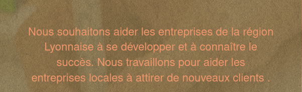


<br />

**Texte du bloc 5 : `#F3976C` en `#FFFFFF` + `position: relative;`**


:::

### Navigation

:::tip Navigation
| Problème identifié | Les éléments d'en-tête ne sont pas dans un ordre séquentiel décroissant |
|-----------|-------------|
| Explication du problème | Des titres correctement ordonnés qui ne sautent pas de niveaux transmettent la structure sémantique de la page, ce qui facilite la navigation et la compréhension lors de l'utilisation de technologies d'assistance. |
| Bonne pratique à adopter | Faire en sorte que tous les éléments de titre suivent un ordre numérique logique qui reflète la structure de votre contenu.<br />S'assurer que le texte du titre transmet clairement le contenu de la section associée. |
| Action recommandée | Ajouter un h2 entre h1 et h3 |
| Référence | <a href="https://web.dev/heading-order/?utm_source=lighthouse&utm_medium=devtools">Heading elements are not in a sequentially-descending order</a> - web.dev |

```html {6-8} title="index.html"
<!-- bloc-2-services -->
<div class="bloc bgc-white l-bloc" id="bloc-2-services">
	<div class="container bloc-md">
		<div class="row">
			<div class="col-xs-12 col-md-8 col-md-offset-2 text-center">
				<h2>La chouette agence est une agence de web design qui aide
					les entreprises à devenir attractives et visibles sur Internet
				</h2>
				<!--  -->
			</div>
		</div>
```

```html {6-8} title="index.html"
<!-- bloc-4-portfolio -->
<div class="bloc bgc-white bg-lines-h2-bg bg-repeat l-bloc" id="bloc-4-portfolio">
	<div class="container bloc-lg">
		<div class="row">
			<div class="col-xs-12 col-md-6 col-md-offset-3 text-center">
				<h2>Nous travaillons avec beaucoup de clients,
					voici nos réalisations :
				</h2>
				<!--  -->
			</div>
		</div>
```
:::

### Formatage des URLs

:::info Formatage des URLs

| Problème identifié | L'URL de la page 2 est mal formatée |
|-----------|-------------|
| Explication du problème | Le nom de l'URL n'est pas clair et compréhensible |
| Bonne pratique à adopter | Les URLs doivent être compréhensibles par un humain, et idéalement ne dépassent pas 115 caractères. |
| Action recommandée | Renommée le fichier `page2.html` par `contact.html`. |
| Référence | <a href="https://www.matthieu-tranvan.fr/referencement-naturel/checklist-seo-25-bonnes-pratiques-on-site-pour-renforcer-votre-referencement-naturel.html">Checklist #SEO : 25 bonnes pratiques on-site pour renforcer votre référencement naturel</a> - matthieu-tranvan.fr |

:::

### Page active

:::info page active

| Problème identifié | La "page 2" (contact) n'est pas fonctionnelle |
|-----------|-------------|
| Explication du problème | La page 2 est mal formatée. |
| Bonne pratique à adopter | L'expérience utilisateur sera enrichie si toute les pages sont attractives |
| Action recommandée | Appliquer les règles de formatage de la page "index". |
| Référence | <a href="https://www.matthieu-tranvan.fr/referencement-naturel/checklist-seo-25-bonnes-pratiques-on-site-pour-renforcer-votre-referencement-naturel.html">Checklist #SEO : 25 bonnes pratiques on-site pour renforcer votre référencement naturel</a> - matthieu-tranvan.fr |

:::

### Images de texte

:::tip images de texte

| Problème identifié | Contenu textuel remplacé par des images |
|-----------|-------------|
| Explication du problème | Google ne sait pas « lire » une image comme un humain. Le texte inclus dans une image n’est pas analysé par le moteur de recherche et ne contribue pas au référencement.<br />De plus, le texte n’est pas responsive. Il risque donc d’être illisible sur mobile… |
| Bonne pratique à adopter | Éviter de remplacer des éléments de web design (par exemple un bouton) ou un contenu textuel par une image. |
| Action recommandée | Remplacer les 3 images de texte par du texte |
| Référence | <a href="https://developer.mozilla.org/fr/docs/Web/Accessibility/Mobile_accessibility_checklist">Check-list pour l'accessibilité mobile</a> - developer.mozilla.org |


:::

### Internationalisation et localisation

:::info Internationalisation et localisation
| Problème identifié | L'élément `<html>` n'a pas de valeur valide pour son attribut `[lang]`. |
|-----------|-------------|
| Explication du problème | La spécification d'une langue valide aide les lecteurs d'écran à annoncer correctement le texte. |
| Bonne pratique à adopter | Pour garantir une prononciation correcte (lecteurs d'écran) de la page dans son ensemble, spécifier une langue BCP 47 valide pour l'élément `<html>`. |
| Action recommandée | Utiliser un code de langue valide dans l'attribut `lang` de l'élément `<html>` : `<html lang="fr">`. |
| Référence | <a href="https://web.dev/html-lang-valid/?utm_source=lighthouse&utm_medium=devtools">`<html>` element does not have a valid value for its `[lang]` attribute</a> - web.dev |

```html title="index.html"
<!-- Remplacer -->
<html lang="Default">

<!-- par -->
<html lang="fr">
```

:::

### Noms et labels

:::info Noms et labels

| Problème identifié | Les liens n'ont pas de nom discernable |
|-----------|-------------|
| Explication du problème | Des liens qui n'ont pas de noms discernables |
| Bonne pratique à adopter | Le texte de lien (et le texte alternatif pour les images, lorsqu'il est utilisé comme lien) qui est discernable, unique et focalisable améliore l'expérience de navigation pour les utilisateurs de lecteurs d'écran. |
| Action recommandée | Ajouter un `<title>` aux liens + un `<alt>` aux images. |
| Référence | <a href="https://web.dev/link-name/?utm_source=lighthouse&utm_medium=devtools">Links do not have a discernible name</a> - web.dev |

```html title="index.html"
<!-- Logo -->
<a class="navbar-brand" href="index.html">
    
</a>
```

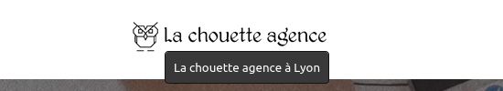

```html title="index.html"
<!-- Liens de navigation -->
<div class="collapse navbar-collapse navbar-1 special-dropdown-nav">
    <ul class="site-navigation nav navbar-nav">
        <li>
            <a href="index.html" title="Retourner à l'accueil">Accueil</a>
        </li>
        <li>
            <a href="contact.html" title="Nous contacter">Contact</a>
        </li>
    </ul>
</div>
```

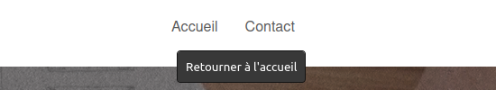
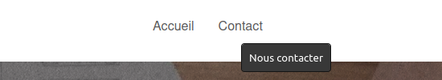

```html title="index.html"
<!-- Logo présentation-->

```

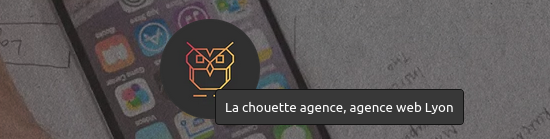

```html title="index.html"
<!-- Bouton "Contact"-->
<div class="text-center">
    <a href="contact.html"
        id="cta-hero"
        class="btn btn-lg btn-clean btn-rd cta-hero btn-atomic-tangerine"
        title="Nous contacter">
        Contact
    </a>
</div>
```

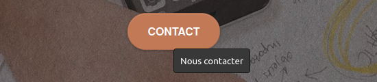

```html title="index.html"
<!-- Lien bloc 3 -->
<a class="ltc-white bold-link"
    href="contact.html"
    title="Nous contacter">
    Contactez notre équipe
</a>
```

```html title="index.html"
<!-- Logos réseaux sociaux Footer -->
<div class="row row-no-gutters social">
    <div class="col-sm-3">
        <div class="text-center">
            <a class="social"
                href="https://twitter.com/"
                alt="twitter"
                title="Retrouvez-nous sur Twitter"
                target="_blank">
                <span class="fa fa-twitter icon-md" alt="twitter"></span>
            </a>
        </div>
    </div>
    <div class="col-sm-3">
        <div class="text-center">
            <a class="social"
                href="https://www.facebook.com/"
                alt="facebook"
                title="Retrouvez-nous sur Facebook"
                target="_blank">
                <span class="fa fa-facebook icon-md" alt="facebook"></span>
            </a>
        </div>
    </div>
    <div class="col-sm-3">
        <div class="text-center">
            <a class="social"
                href="https://dribbble.com/"
                alt="dribbble"
                title="Retrouvez-nous sur Dribbble"
                target="_blank">
                <span class="fa fa-dribbble icon-md" alt="dribbble"></span>
            </a>
        </div>
    </div>
    <div class="col-sm-3">
        <div class="text-center">
            <a class="social"
                href="https://www.instagram.com/"
                alt="instagram"
                title="Retrouvez-nous sur Instagram"
                target="_blank">
                <span class="fa fa-instagram icon-md" alt="instagram"></span>
            </a>
        </div>
    </div>
</div>
```

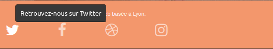
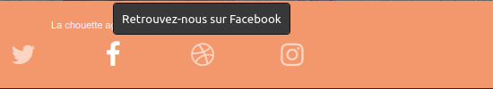
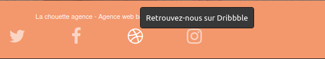
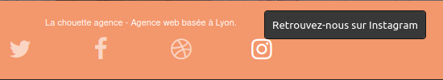

:::

## Les meilleures pratiques

### Confiance et sécurité

:::info Confiance et sécurité
| Problème identifié | Comprend des bibliothèques JavaScript frontales avec des vulnérabilités de sécurité connues |
|-----------|-------------|
| Explication du problème | Certains scripts tiers peuvent contenir des vulnérabilités de sécurité connues qui sont facilement identifiées et exploitées par des attaquants. |
| Bonne pratique à adopter | Arrêter d'utiliser des bibliothèques JavaScript non sécurisées |
| Action recommandée | Effectuer une mise à niveau vers une version plus récente |
| Référence | <a href="https://web.dev/no-vulnerable-libraries/?utm_source=lighthouse&utm_medium=devtools">Includes front-end JavaScript libraries with known security vulnerabilities</a> - web.dev |

```html title="index.html"
<script src="./bootstrap/3.2.5/js/bootstrap.js"></script>
<!-- Remplacer par -->
<script src="./bootstrap/3.4.1/js/bootstrap.js"></script>
```

```html title="index.html"
<script src="./js/jquery-2.1.0.js"></script>
<!-- Remplacer par -->
<script src="./jquery@3.6.0/dist/jquery.js"></script>
```

:::

### Destination d'origine croisée

:::info destination d'origine croisée
| Problème identifié | Les liens vers des destinations d'origine croisée sont dangereux |
|-----------|-------------|
| Explication du problème | Des liens vers une page d'un autre site à l'aide de l'attribut `target="_blank"` exposent le site à des problèmes de performances et de sécurité. |
| Bonne pratique à adopter | L'ajout de `rel="noopener"` ou `rel="noreferrer"` aux liens `target="_blank"` évite ces problèmes. |
| Action recommandée | Ajouter `rel="noopener"` aux liens vers les réseaux sociaux dans le pied de page. |
| Référence | <a href="https://web.dev/external-anchors-use-rel-noopener/?utm_source=lighthouse&utm_medium=devtools">Links to cross-origin destinations are unsafe</a> - web.dev |

:::

## Référencement SEO

### Méta description

:::tip méta description
| Problème identifié | Le document n'a pas de méta description. |
|-----------|-------------|
| Explication du problème | L'élément `<meta name="description">` fournit un résumé du contenu d'une page que les moteurs de recherche incluent dans les résultats de recherche. Une méta description unique de haute qualité rend la page plus pertinente et peut augmenter le trafic de recherche. |
| Bonne pratique à adopter | Utilisez une description unique pour chaque page.<br />Faire des descriptions claires et concises. Éviter les descriptions vagues comme « Maison ».<br />Éviter le bourrage de mots clés. Cela n'aide pas les utilisateurs et les moteurs de recherche peuvent marquer la page comme spam.<br />Les descriptions ne doivent pas nécessairement être des phrases complètes ; ils peuvent contenir des données structurées. |
| Action recommandée | Ajouter un élément `<meta name=description>` au `<head>` de chacune des pages |
| Référence | <a href="https://web.dev/meta-description/?utm_source=lighthouse&utm_medium=devtools">Document does not have a meta description</a> - web.dev |

```html title="index.html"
<!-- changer -->
<meta name="description" content="">
<!-- par -->
<meta name="description" content="La Chouette Agence est une entreprise de Web Design basée à Lyon">
```
:::

### Grammaire

:::info Grammaire
| Problème identifié | Fautes de grammaire |
|-----------|-------------|
| Explication du problème | Du texte contient des fautes de grammaire. |
| Bonne pratique à adopter | L'expérience utilisateur sera enrichie si toute les textes sont écrits avec application. |
| Action recommandée | Corriger les fautes de frappe et de grammaire. |
| Référence | <a href="https://www.matthieu-tranvan.fr/referencement-naturel/checklist-seo-25-bonnes-pratiques-on-site-pour-renforcer-votre-referencement-naturel.html">Checklist #SEO : 25 bonnes pratiques on-site pour renforcer votre référencement naturel</a> - matthieu-tranvan.fr |

Nous aimons collaborer avec des entrepreneurs créatifs et des entreprises <u>locale</u>,
qu’elles aient besoin de créer un site de A à Z ou de donner un coup de
jeune à leur site. Que vous ayez besoin d’une identité visuelle complète ou
d’une refonte de votre site, n’hésitez pas à nous contacter. Nous travaillerons
ensemble pour créer des sites <u>beau</u> et bien structurés, qui seront facilement
trouvable sur les moteurs de recherche.

**Correction**<br />
Nous aimons collaborer avec des entrepreneurs créatifs et des entreprises <u>locales</u>,
qu’elles aient besoin de créer un site de A à Z ou de donner un coup de
jeune à leur site. Que vous ayez besoin d’une identité visuelle complète ou
d’une refonte de votre site, n’hésitez pas à nous contacter. Nous travaillerons
ensemble pour créer des sites <u>beaux</u> et bien structurés, qui seront facilement
trouvable sur les moteurs de recherche.

:::

### Informations « locales »

:::info informations « locales »
| Problème identifié | Des informations locales ciblent l'activité à Paris |
|-----------|-------------|
| Explication du problème | Cibler le bon mots-clé peut avoir un impact positif sur le résultat. |
| Bonne pratique à adopter | La recherche de mots clés locaux est le processus consistant à trouver des mots clés que les gens recherchent lorsqu'ils recherchent des produits et services locaux. |
| Action recommandée | Modifier le mot clé "Paris" par "Lyon" |
| Référence | <a href="https://ahrefs.com/blog/local-keyword-research/">Why is local keyword research important?</a> - ahrefs.com |

```html {4,9,16,17,22,27,32,37} title="index.html"
<!-- head -->
<meta
    name="keywords"
    content="agence design paris">

<!-- Barre de navigation -->
<a class="navbar-brand" href="index.html">
    
</a>

<!-- Bloc de présentation -->


<!-- Bloc portfolio -->


```

:::

### Utilisation de texte caché

:::info Utilisation de texte caché

| Problème identifié | Du texte caché en blanc sur fond blanc, du texte caché en orange sur fond orange |
|-----------|-------------|
| Explication du problème | Un texte caché n'est pas un contenu qui intéresse les internautes et fait parti de la technique du spamdexing, une autre méthode de la Black Hat SEO. |
| Bonne pratique à adopter | Il ne faut pas frôler l'idée d'employer du texte caché si on pense à l'optimisation de ses pages. |
| Action recommandée | Supprimer le texte caché. |
| Référence | <a href="https://seo-reference.net/optimisation/texte-cache.html">L'utilisation du texte caché</a> - seo-reference.net |

```html title="index.html"
<!-- Barre de navigation - avant le logo -->
<!-- Barre de navigation - après le logo -->
<div
    class="keywords"
    style="color:#cccccc;font-size:1px;">
    Agence web à paris, stratégie web, web design, illustrations, design de site web,
    site web, web, internet, site internet, site
</div>

<!-- Pied de page - après les liens des réseaux sociaux -->
<div
    class="keywords"
    style="color:#F3976C;">
    Agence web à paris, stratégie web, web design, illustrations, design de site web, site web,
    web, internet, site internet, site
</div>
```
:::

### Liens sortants

:::info liens sortants
| Problème identifié | Des liens vers des sites pas nécessairement utiles |
|-----------|-------------|
| Explication du problème | Les liens vers des sites ou des ressources non crédibles ne seront pas utiles au site ou à l’utilisateur, et pourraient pénaliser. |
| Bonne pratique à adopter | S'assurer que les sites sont de qualité et font autorité dans leur domaine.<br />Citer des sources d’autorité rend votre contenu plus fiable et plus crédible. |
| Action recommandée | Supprimer les liens vers les sites inconnus ou pas utiles pour le SEO.  |
| Référence | <a href="https://www.agence90.fr/liens-sortants-seo/">Les liens sortants sont-ils importants en SEO ?</a> - agence90.fr |

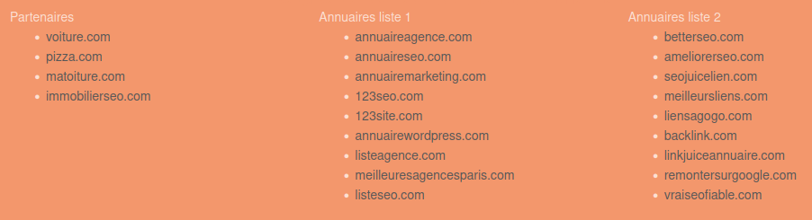

:::

### Mobile Friendly

:::info Mobile Friendly
| Problème identifié | Le document n'utilise pas de tailles de police lisibles |
|-----------|-------------|
| Explication du problème | Les tailles de police inférieures à 12px sont trop petites pour être lisibles et obligent les visiteurs mobiles à « pincer pour zoomer » afin de lire. |
| Bonne pratique à adopter | Vérifier les tailles de police dans le CSS. Essayer d'avoir une taille de police d'au moins 12px sur au moins 60% du texte de la page. |
| Action recommandée | Fixer la taille de police des paragraphes à 100% de la valeur du corps de texte (body) |
| Référence | <a href="https://web.dev/font-size/?utm_source=lighthouse&utm_medium=devtools">Document doesn't use legible font sizes</a> - web.dev<br /><a href="https://www.ionos.fr/digitalguide/sites-internet/web-design/police-de-caracteres-adaptatives-et-commandes-css/">Responsive Web design et CSS</a> - web.dev |

```css title="style.css"
/* Remplacer */
p {
    font-size: 11px;
}
/* par */
p {
    font-size: 1em;
}
```

---


| Problème identifié | Les cibles tactiles ne sont pas de taille appropriée |
|-----------|-------------|
| Explication du problème | Les éléments interactifs tels que les boutons et les liens doivent être suffisamment grands (48x48px) et avoir suffisamment d'espace autour d'eux pour être assez faciles à appuyer sans se chevaucher sur d'autres éléments. |
| Bonne pratique à adopter | Augmenter la taille des cibles de prise trop petites.<br />Augmenter l'espacement entre les cibles tactiles trop rapprochées. |
| Action recommandée | Problème résolu avec la suppression des liens du pied de page. |
| Référence | <a href="https://web.dev/tap-targets/?utm_source=lighthouse&utm_medium=devtools">Tap targets are not sized appropriately</a> - web.dev |


---


| Problème identifié | La page n'est pas complètement responsive |
|-----------|-------------|
| Explication du problème | Il existe une partie du site qui ne s'adapte pas sur mobile |
| Bonne pratique à adopter | Reformater la partie "liens sociaux" afin qu'elle s'affiche en ligne sur mobile. |
| Action recommandée | Utiliser "flex" pour garder aligner les 4 logos. |
| Référence | <a href="https://css-tricks.com/snippets/css/a-guide-to-flexbox/">A Complete Guide to Flexbox</a> - css-tricks |

```css {2-4} title="style.css"
.social {
    display: flex;
    flex-wrap: wrap;
    justify-content: space-around;
    max-width: 400px;
    margin: auto auto auto auto;
}
```


:::